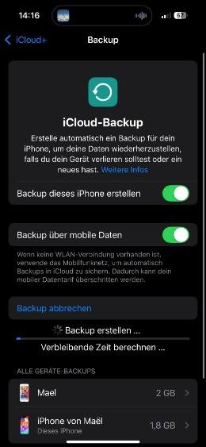

# Anleitung: iCloud-Backup auf meinem iPhone erstellt

## 1. WLAN-Verbindung hergestellt

Ich habe sichergestellt, dass mein iPhone mit einem WLAN-Netzwerk verbunden ist, damit das Backup problemlos funktioniert.

## 2. Einstellungen geöffnet

Danach habe ich die **Einstellungen** geöffnet und oben auf meinen Namen (Apple-ID) getippt, um zu den iCloud-Einstellungen zu gelangen.

## 3. iCloud-Backup aktiviert

In den iCloud-Einstellungen habe ich den Punkt **iCloud-Backup** ausgewählt und überprüft, ob die Funktion aktiviert ist. Der Schalter war schon an, sodass ich direkt weitermachen konnte.

## 4. Backup manuell gestartet

Ich habe auf **Backup jetzt erstellen** getippt. Das Gerät blieb während des Prozesses wie empfohlen im WLAN.

## 5. Backup überprüft

Nach der Fertigstellung habe ich kontrolliert, ob das Backup erfolgreich war. In den iCloud-Backup-Einstellungen konnte ich das Datum und die Uhrzeit des letzten Backups sehen.

# Fazit

Das Erstellen eines iCloud-Backups war einfach und schnell. Es gibt mir Sicherheit, da meine Daten nun in der Cloud gespeichert sind und ich sie bei Bedarf jederzeit wiederherstellen kann.

