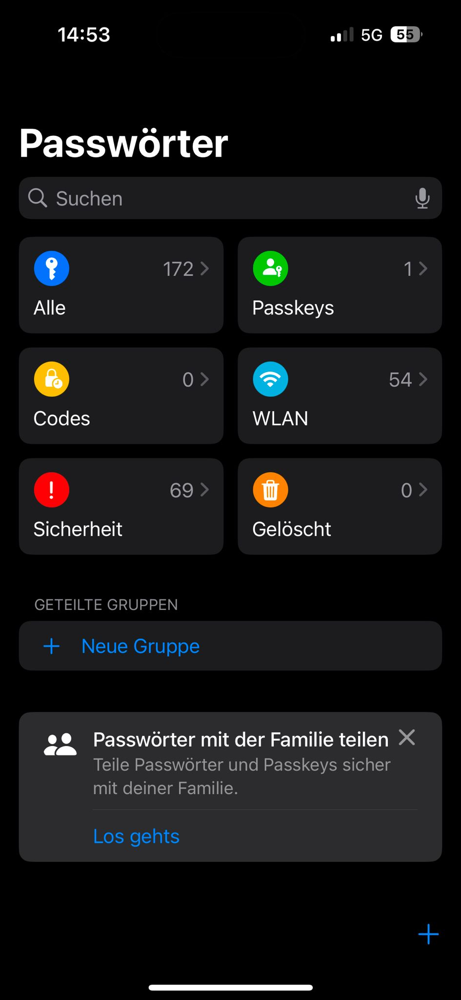

# Passwort-Manager einrichten

Der Passwortmanager von Apple ist auf jedem iPhone mit iOS 17 oder neuer vorinstalliert. Jedes Mal, wenn man ein Passwort setzt oder sich auf einer Website registriert, wird man gefragt, ob man die Zugangsdaten speichern möchte. Gespeicherte Passwörter lassen sich später automatisch auf Websites abrufen. In Apps funktioniert dies jedoch nicht.

